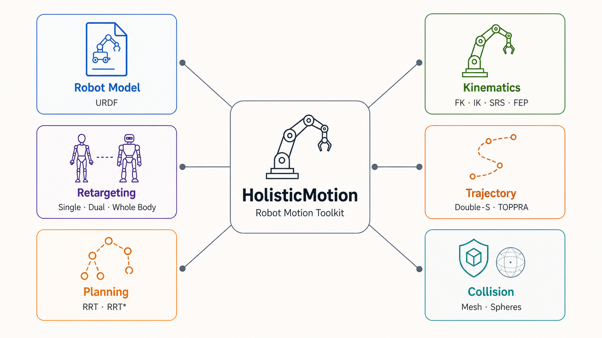
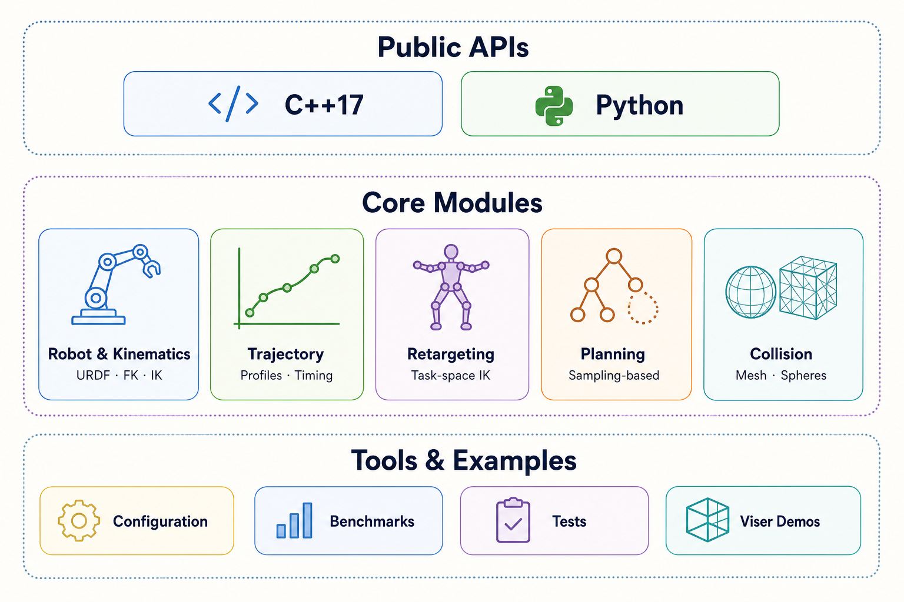

# HolisticMotion

[English](README.md) | 简体中文

HolisticMotion 是一个专注的 C++17 机器人运动库，提供 Python 绑定，涵盖
URDF 机器人模型、运动学、流形数学、求解器相关算法、轨迹生成、可选的
Pinocchio/Coal 碰撞查询以及姿态重定向。

机器人资源不随库分发。所有需要模型的 API 都要求调用方传入明确的 URDF
路径，项目不会隐式下载机器人模型。



## 主要功能

- C++17 核心库和 pybind11 Python 绑定。
- URDF 解析以及数值、OPW、UR、SRS、FEP 运动学。
- 满足约束的 Double-S、梯形速度轨迹和 TOPPRA 路径时间参数化。
- 不依赖 OMPL 的 RRT-Connect、RRT* 和 Informed RRT* 关节空间规划。
- 可通过 `--cuda` 显式启用的 CUDA 批处理后端。
- 默认启用、由 Conan 管理 Pinocchio 和 Coal 的碰撞查询。
- 基于 Pinocchio、支持单臂、双臂和全身模式的任务空间 retargeting 工具箱。
- 英文和简体中文文档。

## 模块组成



| 领域 | 主要 API | 说明 |
| --- | --- | --- |
| 机器人模型与运动学 | `holistic_motion::Robot`、`holistic_motion.Robot` | URDF、FK/IK、OPW、UR、SRS、FEP |
| 轨迹生成 | `holistic_motion.trajectory` | Double-S、梯形速度以及本仓库维护的 TOPPRA 实现 |
| 重定向工具箱 | `holistic_motion.kit.retargeting` | 基于 Pinocchio 的单臂、双臂和全身模式 |
| 碰撞检测 | `CollisionModel`、`SphereCollisionModel` | Pinocchio/Coal 精确网格查询与轻量球体查询 |
| 采样规划 | `holistic_motion.planning` | 本仓库实现的 RRT-Connect、RRT*、Informed RRT* |

## 快速开始

```bash
./scripts/build.sh
source scripts/activate.sh
```

默认构建 Python 绑定以及由 Conan 管理的 Pinocchio/Coal 碰撞组件。使用 `--cuda`
可加入 CUDA 后端，使用 `--no-collision` 可精简构建；加入 `--tests` 可运行测试。
激活脚本会同时设置本地 Python 包和 Conan 动态库路径。只运行单条命令时也可
使用 `./scripts/run.sh python3 ...`。

传入自己的 URDF 和关节构型运行碰撞检测 demo：

```bash
python3 examples/python/collision/basic_query.py \
  --urdf /绝对路径/robot.urdf -q 0 0 0 0 0 0
```

从 URDF 碰撞几何自动生成可编辑的碰撞球模型：

```bash
./scripts/run.sh python3 examples/python/collision/fit_urdf_spheres.py \
  --urdf /绝对路径/robot.urdf \
  --output build/robot_spheres.json

./scripts/run.sh python3 examples/python/visualization/sphere_model_editor.py \
  --urdf /绝对路径/robot.urdf \
  --spheres build/robot_spheres.json
```

球化过程可自动完成；Viser 编辑器用于在规划或批量碰撞查询前检查并调整各
link 局部坐标系中的球体。覆盖率指标、碰撞组以及精确查询与球体查询的取舍参见
[碰撞检测文档](docs/zh_CN/collision.md)。

## Python 示例

```python
import holistic_motion as hm

robot = hm.Robot("/absolute/path/to/robot.urdf")
q = [0.0] * robot.dof
pose = robot.kinematics.forward(q)
solution = robot.kinematics.inverse(pose, q)
```

无需安装外部 TOPPRA 即可对路点路径进行重定时：

```python
from holistic_motion.trajectory import ToppraTrajectory

trajectory = ToppraTrajectory(
    [[0.0, 0.0], [0.4, -0.2], [1.0, 0.5]],
    max_velocity=[1.0, 0.8],
    max_acceleration=[2.0, 1.5],
)
times, positions, velocities, accelerations = trajectory.sample_uniform(200)
```

Retargeting API 位于 `holistic_motion.kit.retargeting`：

```python
from holistic_motion.kit.retargeting import PinkRetargetingSolver

solver = PinkRetargetingSolver(
    "/absolute/path/to/robot.urdf",
    frames={"left_hand": "left_ee", "right_hand": "right_ee", "head": "head_ee"},
    joint_groups={
        "left_arm": ["left_j1", "left_j2"],
        "right_arm": ["right_j1", "right_j2"],
    },
)
solver.set_mode("dual_arm")
result = solver.solve({"left_hand": left_pose, "right_hand": right_pose})
```

使用 `python -m pip install '.[retargeting]'` 安装 Pinocchio Python 运行时；
该命令不会安装上游 Pink。

运行原生双臂采样规划和 Viser 动画：

```bash
./scripts/run.sh python3 examples/python/visualization/rrt_robot_viser.py \
  --urdf /absolute/path/to/robot_with_ee.urdf
```

规划算法由 HolisticMotion 自主实现，不依赖 OMPL。碰撞适配与参数调整参见
[规划文档](docs/zh_CN/planning.md)。

## 文档

```bash
python -m pip install '.[docs]'
./scripts/docs.sh
```

- English 输出：`docs/_build/html/en/index.html`
- 中文输出：`docs/_build/html/zh_CN/index.html`

安装、核心概念、教程、API、架构和贡献说明请阅读[中文文档](docs/zh_CN/index.md)。

## 依赖与致谢

| 项目 | 与 HolisticMotion 的关系 | 许可证 |
| --- | --- | --- |
| [Pinocchio](https://github.com/stack-of-tasks/pinocchio) | 开启碰撞功能时由 Conan 管理的 C++ 碰撞/运动学依赖 | BSD 2-Clause |
| [Coal](https://github.com/humanoid-path-planner/coal) | 开启碰撞功能时由 Conan 管理的窄相碰撞检测依赖 | BSD |
| [Pink](https://github.com/stephane-caron/pink) | 本仓库任务式重定向求解器的算法与 API 设计参考；不导入、不内置 Pink | Apache-2.0 |
| [cuRobo](https://github.com/NVlabs/curobo) | 碰撞球和批量查询的设计参考；不导入、不内置 cuRobo，也不依赖 Torch/Warp | Apache-2.0 |
| [TOPPRA](https://github.com/hungpham2511/toppra) | 本仓库路径时间参数化实现的算法参考；不是运行时依赖 | MIT |

Pinocchio 和 Coal 由 Conan 按 [`conanfile.py`](conanfile.py) 声明的版本解析；
当前默认版本分别为 Pinocchio 3.8.0 和 Coal 3.0.2，可通过
`./scripts/build.sh --no-collision` 一并关闭。仓库不包含 Pink 和 cuRobo 的
源码树。更详细的使用边界、版权和许可证声明见
[`THIRD_PARTY_NOTICES.md`](THIRD_PARTY_NOTICES.md)。

## 验证

```bash
./scripts/build.sh --tests
conan create . --no-remote -o '&:with_python=False'
```
