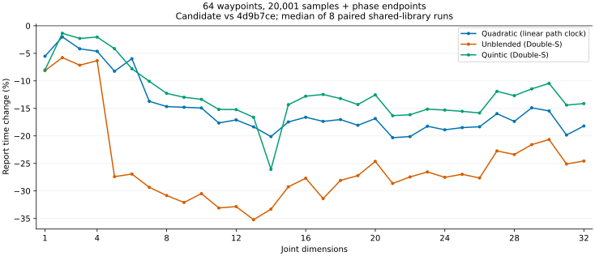

# 直线导数与报告峰值归约优化（2026-09-29）

本轮以 PR #5 的 `4d9b7ce` 为基线，C++ 实现为 `2cdde1b`，
Python 绑定实现为 `76c493b`。
优先调查上一轮 R2 报告回退，并把性能检查扩展到全部 R1–R32。
公共头文件、API、对象布局和依赖没有改变。

## 实现

内置直线的组合求导直接计算 Eigen 系数表达式，避免生成多个中间切向量。
保留每次乘法及零项加法的顺序，不合并时间缩放的幂；混合零项和三次零项
仍保留符号。速度或加速度非有限时使用原通用公式。

报告的公开输出仍为动态向量。在峰值归约时使用固定维度的、默认非对齐
`Eigen::Map`，让编译器保留状态维度，不分配额外峰值向量或提高对齐要求。
位置、速度、加速度、jerk 的有限值检查仍在全部峰值更新之前完成。
几何缓存、阶段归属、单侧端点覆盖、自定义虚函数和回调保护均沿用原实现。

Python 报告直接分配拥有自身内存的 NumPy 向量，再复制对应 C++ 系数，减少
通用 Eigen 转换层的开销。保持字段、dtype、形状、连续存储、可写性及 `OWNDATA`；
数组仍可独立调整大小，不引用临时报告或轨迹对象。

## 最终性能

以下是最终安装/导出产物的结果，不是中间原型数据。C++ 使用同一个调用
程序切换冻结基线和候选共享库，记录动态链接路径及库/程序 SHA-256。
固定 CPU 15，8 组交替配对；报告另加入 `ab7bb2a` 共享库进行 8 组三方轮换。
GCC 12.3，库为 Release `-O3`，调用程序为 `-O2`；报告先预热，再取 21 次
重复的中位数。全部校验和、时长及非计时字段一致。

负值表示本轮候选耗时减少。以下均为 20,001 个均匀采样，并包含内部阶段
双侧端点；二次路径使用显式线性路径时钟，其余路径使用 Double-S。

| 工况 | 基线 | 候选 | 耗时变化 |
| --- | ---: | ---: | ---: |
| R2 直线，4 路点 | 468.236 µs | 440.820 µs | -5.9% |
| R7 二次，64 路点 | 1442.376 µs | 1244.541 µs | -13.7% |
| R14 直线，4 路点 | 1371.827 µs | 908.795 µs | -33.8% |
| R32 直线，64 路点 | 2769.528 µs | 2089.205 µs | -24.6% |
| SE3 二次，64 路点 | 4471.113 µs | 4392.695 µs | -1.8% |

| 分组 | 工况数 | 耗时变化中位数 | 最小至最大耗时变化 |
| --- | ---: | ---: | ---: |
| 全部报告 | 594 | -18.8% | -47.2% 至 +9.3% |
| 组合状态与独立查询 | 20 | -0.2% | -19.2% 至 +1.6% |
| Rn 完整构造 | 32 | -1.6% | -18.9% 至 +3.5% |
| 限速采样 | 10 | -0.6% | -2.2% 至 +0.1% |
| Rn/SE3 完整构造诊断 | 10 | -0.3% | -2.7% 至 +0.6% |

报告覆盖 R1–R32 和 SE3，共 594 个配置，其中 Rn 为 576 个。
全部密集报告（2,001 / 20,001 点）的范围为 -35.5% 至 -0.3%。
最差报告工况为 Rn3、4 路点、
2 次路径、混合容差 0.0050000000000000001、2 采样：
0.155 → 0.170 µs（+9.3%）。
保留短报告的回退；小于微秒的结果尤其容易受计时开销和代码布局影响。

另以每批 1/16/256 次调用复查全部 R1–R32 的两个路点配置，共 192 个二次
短报告工况、8 组配对。每批 256 次时，Rn3、4 路点从 166.137 增至
170.988 ns（+2.9%），回退没有完全消失。这组计时包含结果赋值及旧结果释放，
范围不同，不能替代上面单次报告的 155/170 ns 数据。全部批量配置输出一致。

| Rn 路径配置 | 采样数 | 64 个工况的耗时变化范围 |
| --- | ---: | ---: |
| 二次混合 | 2 | -27.2% 至 +9.3% |
| 二次混合 | 2,001 | -23.5% 至 -2.3% |
| 二次混合 | 20,001 | -23.5% 至 -2.0% |
| 直线，无混合 | 2 | -47.2% 至 -3.3% |
| 直线，无混合 | 2,001 | -35.4% 至 -5.4% |
| 直线，无混合 | 20,001 | -35.5% 至 -5.8% |
| 五次混合 | 2 | -35.1% 至 +0.7% |
| 五次混合 | 2,001 | -28.3% 至 -1.6% |
| 五次混合 | 20,001 | -28.1% 至 -1.4% |



图固定 64 路点和 20,001 个均匀采样。部分 R1 路径不实际产生混合段。

### R2 历史回退

同一程序加载更早 `ab7bb2a`、本轮基线 `4d9b7ce` 和最终候选：R2、4 路点、
无混合、20,001 点报告分别为 438.500、468.236、
440.820 µs。相对本轮基线为 -5.9%；相对 `ab7bb2a` 为
+0.5%。因此不能将本轮改善表述为所有
历史回退都已消除。旧版和 main 的既有累计测量保留在
[上一轮报告](optimization_20260929_sampling.md)，不与本轮增量混用。

Python 使用两个安装后的扩展、8 组交替配对，共 68 个报告/采样工况。
返回数组/字典摘要和轨迹时长一致，耗时变化范围为
-28.9% 至 +3.3%。
其中上述 R2 报告从 477.951 降至 443.288 µs
（-7.3%）。这些是单机微基准，不代表所有应用负载。

### Python 短报告

另以批量调用摊薄 Python 计时器开销，8 组配对覆盖 28 个工况。下表为 2 个均匀
采样的完整 Python 调用，仍包含所有阶段端点；基线同为 `4d9b7ce`。

| 工况 | 基线 | 最终候选 | 耗时变化 |
| --- | ---: | ---: | ---: |
| Rn2，4 路点 | 2.886 µs | 1.782 µs | -38.2% |
| Rn7，4 路点 | 3.651 µs | 2.157 µs | -40.9% |
| Rn32，4 路点 | 5.929 µs | 4.142 µs | -30.1% |
| SE3，2 路点 | 2.003 µs | 1.567 µs | -21.8% |

数组所有权回归覆盖两种规划、Rn 与笛卡尔轨迹：不同报告和字段不共享内存，
修改或调整大小不影响轨迹及后续结果，删除报告和轨迹后保留的视图仍有效。

### 相对 main 的累计结果

另用冻结 main `ad40df8` 的调用程序与最终 C++ 产物进行 8 组交替配对。
这组比较使用分别静态链接的程序，不能与上面的同程序共享库测量混用绝对耗时。
152 个工况中，Rn 摘要和时长完全相同，SE3 最大相对摘要/时长差为
`9.41e-16`；这不是全部底层状态逐位相同的声明。

| 累计工况 | main | 最终候选 | 耗时变化 |
| --- | ---: | ---: | ---: |
| Rn7 二次报告，64 路点、20,001 采样 | 2610.847 µs | 1208.511 µs | -53.7% |
| SE3 二次报告，64 路点、20,001 采样 | 7260.035 µs | 4325.977 µs | -40.4% |
| SE3 大尺度完整构造 | 4296.681 µs | 2836.675 µs | -34.0% |

完整构造、查询、五次报告、限速构造诊断、其他报告的耗时变化范围依次为
−25.7% 至 −0.7%、−23.4% 至 −0.9%、−33.6% 至 −4.0%、
−34.0% 至 +0.1%、−53.7% 至 −0.7%。原始配对及可执行文件哈希随归档保存。

## 数值与兼容性

- 新种子 `2026092903 + DoF + 100 * is_SE3`，R1/R2/R3/R7/R14/R20/R27/R32/SE3
  共 4,500 个随机路径及时钟输入。4,496 个成功输入在 3/65/2,001 点报告下，
  全部数值字段和判定的十六进制输出逐位一致；保留相同的 4 个路径拒绝。
  完整输出 SHA-256：`fdaa483077a3bc700f95b2adec4805a53999887ddf64f297530758fb745c71d8`。
- 同一套 699,840 组直线算术输入分别在默认及 `-march=native` 编译下运行。
  与冻结基线的通用公式比较，有限值、非有限值类别和正负零无差异。
  两次运行使用同一语料，不计为新的独立样本。
- 既有 20,000 个 Rn Python 输出指纹重新运行，与本轮冻结扩展一致。
- 新回归覆盖 R1/R3/R14/R32 每个系数的不同峰值、零符号，以及最后一个
  采样点的末尾系数出现 NaN/正负无穷大。异常之后的新报告仍与原结果一致。
- 一个使用旧 main 头文件编译的消费者在两套共享库上通过全部 R1–R32，
  输出逐位一致；另有标准包消费者、旧头文件链式求导和 SE3 消费者通过。

动态符号比较未删除公开的非内联函数。两个消失的弱符号属于私有
`PSpline::ComputePhaseEndpoint` 和报告局部 lambda；新增符号属于 Eigen 内部实现。
不将旧头文件消费者通过表述为整个动态符号集合完全相同。

采样密度不变，有限采样不证明采样点之间的连续约束满足。

## 未采用的实验

手写系数循环和合并有限值检查的循环使部分高维报告变慢，未采用。
单独的固定维度映射曾使 R14 部分报告慢约 12%–18%；只有与直线系数表达式
组合后，才通过全维度复核。固定维度 `head()`、保留动态归约，以及将通用
曲线公式也改成系数表达式的组合未显示更好的整体结果，未采用。
原型数据与最终产物数据分开保存，没有针对特定关节维度添加例外分支。

Python 数组移动所有权的原型未采用：它改变 NumPy 的 `OWNDATA`，且独立分配
NumPy 输出的方案在短报告中更快。9 组三方轮换比较了 28 个配置，保留全部原始
结果；最终 Python 测量在实际安装扩展上重新运行。

## 验证与复现

| 检查 | 结果 |
| --- | --- |
| Core CTest / Python | 24/24；1,109 passed / 140 skipped |
| Collision CTest / Python | 25/25；791 passed / 458 skipped |
| ASan/UBSan、Eigen 断言、默认泄漏检测 | 25/25 |
| 共享 Conan 包测试 | 24/24；标准及旧头文件消费者通过 |

Sanitizer 编译日志仍有既有 Eigen / `tl::optional` 的 `-Wmaybe-uninitialized`
告警；测试通过不表示编译无告警。Python 跳过数量取决于可选依赖。

| 产物体积 | 基线 | 候选 | 变化 |
| --- | ---: | ---: | ---: |
| 静态库 | 20,710,646 B | 20,695,270 B | -0.1% |
| 共享库 | 9,751,168 B | 9,754,000 B | +0.0% |
| Python 扩展 | 10,018,056 B | 10,034,504 B | +0.2% |

主要命令如下，先按项目构建指南完成 Conan/CMake 配置：

```bash
cmake --build build/hour-core -j2
ctest --test-dir build/hour-core --output-on-failure
cmake --install build/hour-core --prefix /tmp/hm-fourteenth-install
cmake --build build/cmake -j2
ctest --test-dir build/cmake --output-on-failure
cmake --build build/hour-collision-sanitizers -j1
ctest --test-dir build/hour-collision-sanitizers --output-on-failure
conan create . --no-remote -o '&:with_python=False' -o '&:with_collision=False' -o '&:with_cuda=False' -o '&:with_tests=True' -o '&:shared=True' -c tools.build:jobs=2
./build/hour-core/trajectory_sampling_benchmark --all-dimensions > sampling_all.csv
```

仓库基准的默认 90 个配置和 `--all-dimensions` 的 594 个配置均不需要机器人
资源。正式计时使用同一源码编译的独立 `-O2` 调用程序；完整脚本、编译参数、
原始 CSV、全部配对离散程度、最终检查日志和 SHA-256 随证据保存。

本轮证据前缀为 `/tmp/hm-fourteenth-*`，归档为
`build/validation_20260929_followup.tar.gz`。归档包含基线/候选产物、源码快照、
未采用原型及逐文件校验清单；构建产物不提交，原有 `assets/` 未修改。
最终提交的 CI 和严格中英文文档构建结果记录在 PR 与归档日志中。
