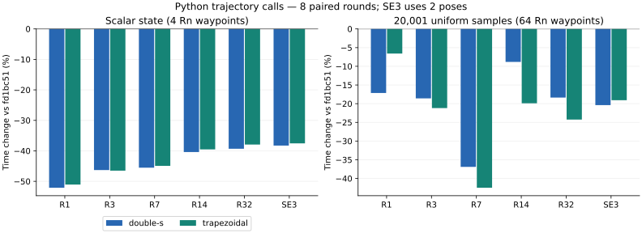

# Python 状态转换、批量采样与报告分配优化（2026-09-29）

本轮基线为 PR #5 的 `fd1bc51`，实现提交为 `e02247e`。
优化重复查询中的数组转换、曲线准备和报告固定开销。
公共成员签名、对象布局和依赖不变；`TrajectoryBase` 与 `PSpline` 的公开头文件
仅增加内部采样器的前置声明和友元声明。

## 实现

- 标量 `state()` 直接创建自有 NumPy 向量并复制系数，保留形状、dtype、
  可写性、`OWNDATA` 和独立生命周期。Cartesian 位姿矩阵沿用原转换方式。
- 均匀时间网格直接写入 NumPy 缓冲区。关节采样返回 C++ 数组集合，再组装
  最终 Python 元组，减少时间向量复制和中间元组。
- 报告与 Python 批量采样共用每次调用独立的状态工作区，复用时间阶段及
  内置几何控制差值。乱序查询保留原节点吸附与阶段选择；原生直线直接求
  位置和切向量，避免生成随后丢弃的零高阶导数。自定义几何继续走虚函数。
- 连续性阈值在比较中求值，每个报告省去两条临时动态向量；完整状态的
  有限值检查仍在峰值更新前执行。端点回调检查保持原有范围，不增加事务保证。
- 报告字典复用由绑定闭包持有的不可变键，避免每次重新创建和哈希字符串。
  每次报告及其数组仍独立；键不保存在进程级静态 Python 对象中。

链式求导公式、运算次序和极端值回退没有改变。内部模板移入 `detail`
命名空间，使共享采样器可在不同实现单元中内联。

## 最终安装产物测量

固定逻辑 CPU 15，GCC 12.3，库为 Release `-O3`，C++ 调用程序为 `-O2`。
共享开发机使用原频率配置；没有修改调度或其他进程。C++ 报告每个配置先预热，
再取 21 次重复的中位数，8 组配对。报告将 R1–R32 与 SE3 分组随机排列，
同一组的两套共享库相邻运行，以缩短比较间隔；使用同一个调用程序并记录
动态链接路径、源文件及产物 SHA-256。输出校验和和全部非计时字段一致。

Python 使用冻结与最终安装的扩展，8 组交替配对。新增基准包含完整调用、
结果赋值和上一结果释放；摘要在计时外计算，包含数值、形状、dtype、步长、
所有权和可写性。它与 C++ 单次调用的计时范围不同。
以下负值均表示候选耗时减少；中位变化按配置计算，各配置权重相同。

| 分组 | 配置数 | 耗时变化中位数 | 最小至最大变化 |
| --- | ---: | ---: | ---: |
| C++ 报告 | 594 | -5.4% | -31.1% 至 +17.8% |
| C++ 状态与独立查询 | 20 | -0.1% | -2.8% 至 +3.8% |
| Rn 完整构造 | 32 | +1.5% | -3.3% 至 +7.3% |
| 限速采样 | 10 | +1.9% | -0.3% 至 +10.4% |
| Python 标量状态 | 22 | -46.2% | -52.7% 至 -37.5% |
| Python 均匀采样，2 点 | 22 | -23.1% | -25.9% 至 -16.6% |
| Python 均匀采样，65 点 | 22 | -15.3% | -34.0% 至 +5.0% |
| Python 均匀采样，2001 点 | 22 | -18.0% | -41.8% 至 +1.5% |
| Python 均匀采样，20001 点 | 22 | -18.8% | -42.5% 至 -4.4% |
| Python 原采样/报告基准 | 68 | -13.4% | -42.0% 至 +1.1% |
| Python 短报告 | 7 | -13.5% | -21.6% 至 +3.1% |

Python 代表值如下，时间单位均为 µs。均匀采样行采用 Double-S 和混合容差
0.005；短报告行采用无混合轨迹，并仍计算内部阶段的双侧端点。

| 工况 | 基线 | 候选 | 耗时变化 |
| --- | ---: | ---: | ---: |
| Rn7 状态，4 路点 | 1.136 | 0.619 | -45.5% |
| Rn32 状态，4 路点 | 1.334 | 0.810 | -39.3% |
| Rn7 均匀采样，64 路点、20,001 点 | 2857.466 | 1802.839 | -36.9% |
| Rn32 均匀采样，64 路点、20,001 点 | 5728.503 | 4676.250 | -18.4% |
| SE3 均匀采样，20,001 点 | 2559.757 | 2037.834 | -20.4% |
| Rn2 报告，4 路点、2 点 | 1.837 | 1.461 | -20.5% |
| Rn7 报告，4 路点、2 点 | 2.216 | 1.738 | -21.6% |
| SE3 报告，2 点 | 1.590 | 1.302 | -18.1% |



仍保留回退：C++ 报告最差配置为 Rn4、
4 路点、2 次路径、混合 0.005、
20001 点，+17.8%；
新增 Python 基准最差配置为 Rn3、
64 路点、trapezoidal、uniform、
65 点，+5.0%。
微基准的局部回退和噪声均保留，不能据这些结果承诺所有应用负载都加速。

另以每批 1/16/256 次复查 192 个二次短报告配置。计时包含结果赋值和旧结果
释放，与单次报告不同，不能直接替换其绝对耗时。
Rn3、4 路点、每批 256 次从 177.662 变为 136.352 ns。

## 历史对照与分配

同一程序另外加载三个历史共享库，8 组轮换比较 R2/R3 的 36 个配置。
以下独立对照的时间单位为 µs，不将其绝对值与上面的主测量混用。

| 工况 | ab7bb2a | 4d9b7ce | fd1bc51 | 候选 |
| --- | ---: | ---: | ---: | ---: |
| Rn2 直线，4 路点、20,001 点 | 446.601 | 486.907 | 450.349 | 400.268 |
| Rn3 二次，4 路点、2 点 | 0.151 | 0.166 | 0.171 | 0.121 |

在 594 个 R1–R32/SE3 报告配置中，分配拦截器测得每次堆分配均从 10 次降至
8 次，峰值及判定一致。该计数针对 C++ 报告，不包含 Python 字典和 NumPy 分配。
相对 main 的更早累计结果保留在[上一轮报告](optimization_20260929_followup.md)，
本轮主要结论使用 `fd1bc51` 增量基线。

## 数值、生命周期与兼容性

- 种子 `2026092904 + DoF + 100 * is_SE3` 的 4,500 个随机路径及时钟输入：
  相同的 4,496 个成功输入和 4 个路径拒绝；3/65/2,001 点报告的全部字段逐位一致。
- 384 个关节轨迹/时间缩放配置覆盖全部 R1–R32、两种剖面及多种路径长度。
  131,328 次标量对照包括随机顺序、反向步长、重复节点、节点相邻浮点数和
  超出时域的有限时间。批量与标量状态逐位相同，包含正负零。
- 108 个 Cartesian 采样配置覆盖小角度、半周及其相邻角度，尺度从 `1e-6`
  到 `1e6`；位姿和导数与标量查询及基线逐位一致。
- 同一套 699,840 个极端直线算术输入在默认和 `-march=native` 下分别运行，
  有限结果、非有限类别和零符号保持一致；两次使用同一语料。
- 连续性测试检查阈值前后相邻浮点数、阈值本身及小于 1 的限制；Python
  回归验证自有缓冲区、调整大小、相互独立、对象删除后的视图和时间网格。
- Python 调试分配器下，32 维度共 4,096 次报告/状态调用通过；保留的方法
  可在包装对象删除后调用，独立输出可修改、调整大小和释放。
- 既有 20,000 个 Rn 指纹、全部 Python 公共类方法文档签名和旧 main 头文件
  的 R1–R32 消费者保持一致，另有标准包、链式求导及 SE3 消费者验证。

动态符号变化涉及报告局部 lambda、内部采样器及 Eigen 模板实例，未删除公开
非内联函数；不将消费者通过表述为整个动态符号集合完全相同。

采样密度与报告定义不变，有限采样仍不能证明采样点之间的连续约束满足。

## 验证与复现

| 检查 | 结果 |
| --- | --- |
| Core CTest / Python | 24/24；1,175 passed / 140 skipped |
| Collision CTest / Python | 25/25；857 passed / 458 skipped |
| ASan/UBSan、Eigen 断言、默认泄漏检测 | 25/25 |
| 共享 Conan 包 | 24/24；标准及旧头文件消费者通过 |

Python 跳过数量随可选依赖变化。Sanitizer 编译日志保留既有 Eigen / `tl::optional`
的 `-Wmaybe-uninitialized` 告警；测试通过不表示编译无告警。
新增测试和基准不需要外部机器人资产。

按项目指南配置后，可用以下命令构建和运行新增基准：

```bash
cmake --build build/hour-core -j2
ctest --test-dir build/hour-core --output-on-failure
cmake --install build/hour-core --prefix build/install
PYTHONPATH=$PWD/build/install python benchmarks/python_trajectory_benchmark.py
PYTHONPATH=$PWD/build/install pytest tests/python/test_trajectory_sampling.py
conan create . --no-remote -o '&:with_python=False' -o '&:shared=True'   -o '&:with_collision=False' -o '&:with_cuda=False'   -o '&:with_tests=True' -c tools.build:jobs=2
```

基准默认输出 110 个配置的 CSV，`--repeats` 控制每配置的计时重复次数。
配对脚本、原始测量、源码与产物哈希、完整日志及可重放消费者保存在本地
`build/validation_20260929_python_sampling.tar.gz`，未将构建产物或 `assets/` 提交。

外置逐点求值函数的原型引入明显报告回退，未采用；最终采用可内联工作区和
直线直接求值。另以同一最终共享库对象进行三个报告原型对照，各 6 组、594 配置：强制内联
能改善 R4，但使 R7 五次密集报告回退约 9.5%；模板消费回调使最差配置回退约
24.6%；恢复原局部报告循环使耗时变化中位数为 +6.4%。这三种方案均未采用，
完整报告数值对照均一致。原型数据以独立名称保存，不属于最终实现测量。

单次、批量、安装扩展和历史对照的数据分别保存，未混为同一计时。
