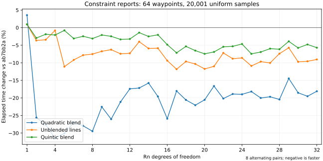

# 轨迹采样与直线状态优化（2026-09-29）

本轮以 PR #5 的 `ab7bb2a` 为基线，生产实现为 `efdee34`。
主要处理上一轮 Rn7 二次曲线报告的性能回退、重复采样的阶段查找，以及内置直线
状态中的零导数运算。公共头文件、接口、对象布局和依赖保持不变。

## 实现与行为

- 内置 Rn 二次曲线在一次采样操作中复用两个控制点差值和恒定曲率；保持原
  Bernstein 表达式、参数截断/归一化顺序，以及长度平方溢出时的两次除法。
- 用 `std::variant` 为互斥的直线、二次、五次曲线工作区共用存储。缓存只存活于
  一次构造或报告，仍由局部 `shared_ptr` 保持几何所有权；派生类逐次调用虚函数。
- 约束报告复用上一时间阶段索引；离开该阶段或索引失效时回到原查找逻辑。
  保持节点吸附、非单调路径位置、阶段几何归属和所有单侧端点检查。
- 内置直线复用零高阶几何导数，保留正负零符号和加法次序；非有限速度或加速度
  仍使用通用链式公式。用于 Rn 组合状态，以及所有内置直线的报告和构造采样。

局部采样工作区大小如下，公共类型没有改变：

| 类型 | 基线 | 候选 |
| --- | ---: | ---: |
| R2 | 336 B | 304 B |
| R7 | 824 B | 760 B |
| R20 | 2208 B | 2032 B |
| R32 | 3456 B | 3184 B |
| SE3 | 544 B | 320 B |

新增回归复现了一个既有崩溃：自定义几何回调在报告的端点检查中替换为更短时钟，
后续查询仍使用原阶段索引。冻结基线进程返回 `SIGSEGV`；候选保留时钟所有权，
并在时钟指针、阶段数量或轨迹/路径有效状态改变时抛出 `std::logic_error`。
回归覆盖时钟指针替换及原地缩短。这不是任意可变状态的事务快照或并发写入保证。

## 最终性能

所有变化均为候选相对基线的耗时变化，负值表示更快。主 C++ 对照使用 12 组
交替配对，固定 CPU 15；每个工况先预热，再取内部重复的中位数。编译器为
GCC 12.3，库使用 Release `-O3`，独立调用程序使用 `-O2` 且保留断言。
完整 152 个工况的时长及输出校验均不变。以下为本轮相对 `ab7bb2a` 的结果：

| 工况 | 基线 | 候选 | 耗时变化 |
| --- | ---: | ---: | ---: |
| Rn7 二次报告，64 路点、20,001 采样 | 2011.808 µs | 1384.351 µs | -31.2% |
| Rn7 直线报告，64 路点、20,001 采样 | 1115.622 µs | 1009.156 µs | -9.5% |
| Rn32 五次报告，64 路点、20,001 采样 | 3889.818 µs | 3591.803 µs | -7.7% |
| Rn7 组合状态，4 路点 | 77.943 ns | 73.578 ns | -5.6% |
| Rn20 组合状态，4 路点 | 124.094 ns | 117.186 ns | -5.6% |
| Rn32 直线报告，64 路点、2 采样 | 71.305 µs | 78.062 µs | +9.5% |

完整分组范围如下，包含没有收益和变慢的工况：

| 分组 | 工况数 | 最小至最大耗时变化 |
| --- | ---: | ---: |
| Rn 完整构造 | 32 | -7.4% 至 +2.7% |
| Rn/SE3 状态及独立查询 | 20 | -5.6% 至 +1.1% |
| 五次曲线报告 | 30 | -7.9% 至 -0.6% |
| 组合限速与预限速构造 | 10 | -7.0% 至 +1.3% |
| 二次曲线及无混合报告 | 60 | -32.2% 至 +9.5% |

另以 8 组配对扩展至全部 R1–R32，共 576 个报告配置，输出摘要全部一致。
以下范围同时包含 4/64 路点；二次曲线使用显式线性路径时钟，不能将该结果
理解为标准 Double-S 对二次曲线的支持。部分 R1 路径不实际产生混合段。

| 路径配置 | 采样数 | 64 个工况的耗时变化范围 |
| --- | ---: | ---: |
| 二次混合 | 2 | -11.9% 至 +11.8% |
| 二次混合 | 2,001 | -32.7% 至 +3.3% |
| 二次混合 | 20,001 | -31.5% 至 +3.6% |
| 直线，无混合 | 2 | -18.5% 至 -3.5% |
| 直线，无混合 | 2,001 | -12.2% 至 +8.3% |
| 直线，无混合 | 20,001 | -11.8% 至 +3.2% |
| 五次混合 | 2 | -13.8% 至 +0.4% |
| 五次混合 | 2,001 | -7.6% 至 +9.1% |
| 五次混合 | 20,001 | -8.1% 至 +3.6% |



图中固定 64 路点和 20,001 个均匀采样；每次报告仍包含所有内部阶段的双侧端点。
两个独立链接的基准程序在部分短报告上出现不同幅度甚至相反方向的变化：
例如 Rn32、64 路点、2 采样的直线报告，在原 60 工况程序中从 71.305 增至
78.062 µs，在全维度程序中从 71.350 降至 66.772 µs。保留两组结果，不将这些
短报告的收益当作稳定结论。

为复核上述差异，同一个调用程序分别加载冻结基线和候选共享库，确认动态
链接路径及库 SHA-256，另跑 8 组配对。Rn32 的该短报告从 73.965 降至
67.703 µs（−8.5%）；R2、4 路点、20,001 采样的直线报告从 439.798 增至
469.273 µs（+6.7%），与 Python 的回退方向一致。共享库 60 个报告工况的
范围为 −26.2% 至 +7.3%，20 个查询工况为 −7.4% 至 +2.6%。这项复测
减小了调用程序变化的影响，但不能消除共享库内部代码布局等因素。

Python 使用安装后的两个扩展、固定 CPU、8 组交替配对，检查返回数组/报告的
SHA-256 及轨迹时长相同。68 个采样/报告工况的耗时变化为 -11.5% 至 +7.2%。
其中 R2、4 路点、无混合、20,001 点报告从 440.915 增至 472.748 µs（+7.2%）；
Rn32 的部分批量采样也存在回退和较宽波动，不能据此宣称 Python 全面加速。

为了区分本轮增量与整个 PR 的效果，另以冻结 `main` 的 `ad40df8` 运行 8 组配对：

| 相对 main 的累计工况 | main | 本轮候选 | 耗时变化 |
| --- | ---: | ---: | ---: |
| SE3 大尺度完整构造 | 4357.147 µs | 2868.989 µs | -34.2% |
| SE3 二次报告，64 路点、20,001 采样 | 7191.953 µs | 4445.940 µs | -38.2% |
| Rn7 二次报告，64 路点、2,001 采样 | 223.132 µs | 146.291 µs | -34.4% |

累计 152 个工况中，完整构造、查询、五次报告、限速构造及其他报告的耗时
变化范围依次为 -12.2% 至 +0.7%、-10.6% 至 +0.8%、-15.3% 至 -2.9%、-34.2% 至 +0.0%、-38.2% 至 +2.0%。
更早 `19e6c1d` 的 8 组三方复测只用于数值语义可比的 Rn 查询和 SE3 无混合
报告：Rn 查询仍有约 2.9% 的最差历史回退，不能视为已全部恢复。
所有原始配对和离散程度数据随证据归档，单机微基准不代表所有应用负载。

## 数值复核

本轮新增检查：

- 二次曲线种子 `2026092901 + DoF`，R1/R2/R3/R7/R16/R20/R32 共 35,000 个
  输入，34,776 条有效曲线、1,147,608 个采样点；复用求值与标量接口逐项一致，
  没有正负零变化，拒绝数量与冻结基线相同。
- R1/R2/R7/R20/R32/SE3 共 699,840 组直线组合求导算术检查，覆盖零、正负极小/
  极大值、非有限值和时间缩放；有限值、非有限值类别、正负零均无差异。
- 种子 `2026092902 + DoF + 100 * is_SE3`，6,000 个 Rn/SE3 路径及时钟输入，
  保留相同的 19 个路径拒绝。其余 5,981 个输入在 3/65/2,001 点报告下的全部
  数值字段及判定逐位一致。十六进制输出文件 SHA-256：
  `94492e4d300b028f51a3de60c6062e85f434a3de0403b254a6e65e34c6553c2e`。
- 阶段选择回归覆盖 `1e-280`、`1`、`1e280` 时间尺度、2/67/1,024 个阶段、
  超短阶段、时长放大，以及自定义查询在采样途中更换时钟或使轨迹失效。

以下既有语料重新运行，不作为新增独立样本：

- 20,000 个 Rn 完整输出摘要逐位一致。
- 5,000 个路径输入的有效路径长度及 129 个位姿摘要逐位一致，保留 355 个拒绝。
- 5,000 个 SE3 轨迹输入保留 337 个拒绝；4,663 个有效输入没有新增有限值、
  采样限值或规定的连续性失败，报告最大利用率的配对差异为零。
- 136 个密集输入保留 10 个拒绝；126 个有效轨迹在原时长和 1.7 倍时长下检查
  20,001 点报告及阶段端点。
- 20,000 条曲线的有限差分与 2,000 条路径、12,000 个内部点的独立完整伴随
  参考通过，误差水平与上一轮一致。

采样密度未降低；有限采样仍不证明采样点之间的连续约束满足。

## 验证与证据

| 检查 | 结果 |
| --- | --- |
| Core CTest / Python | 24/24；1,101 passed / 140 skipped |
| Collision CTest / Python | 25/25；783 passed / 458 skipped |
| ASan/UBSan、Eigen 断言、默认泄漏检测 | 25/25 |
| 共享 Conan 包导出测试 | 24/24 |
| 共享库消费者 | 标准消费者、main 旧头文件 Rn 消费者及链式求导、安装头文件 SE3 消费者通过 |

主要验证命令如下；不同 Python 环境的可选依赖造成上述跳过数量不同：

```bash
cmake --build build/hour-core -j2
ctest --test-dir build/hour-core --output-on-failure
cmake --install build/hour-core --prefix /tmp/hm-thirteenth-install
PYTHONPATH=/tmp/hm-thirteenth-install /usr/bin/python3 -m pytest tests/python -q -rs -p hypothesis.extra.pytestplugin
cmake --build build/cmake -j2
ctest --test-dir build/cmake --output-on-failure
cmake --install build/cmake --prefix build/install
./scripts/run.sh /tmp/hm-three-hour-minimal-test-venv/bin/python -m pytest tests/python -q -rs -p hypothesis.extra.pytestplugin
cmake --build build/hour-collision-sanitizers -j1
ctest --test-dir build/hour-collision-sanitizers --output-on-failure
conan create . --no-remote -o '&:with_python=False' -o '&:with_collision=False' -o '&:with_cuda=False' -o '&:with_tests=True' -o '&:shared=True' -c tools.build:jobs=2
./scripts/docs.sh
```

Sanitizer 编译日志保留既有 Eigen / `tl::optional` 的 `-Wmaybe-uninitialized`
告警；没有将测试通过描述成无编译告警。严格中英文文档构建及最终提交的 GitHub
检查结果记录在 PR 和归档的对应日志中。


固定峰值向量原型未采用：它让 Rn32 的部分报告变慢约 7%–9%。共享时间查询
模板原型也未采用，避免给独立标量查询增加调用层。保留这些实验的原始数据，
不将中间候选成绩当作最终结果。

证据使用 `/tmp/hm-thirteenth-*` 前缀，最终归档为
`build/validation_20260929_sampling.tar.gz`，包括基线/候选产物、原始 CSV、
运行脚本、编译参数、测试和 CI 日志、逐文件 SHA-256 清单以及解包验证记录。
生成构建产物不加入版本控制，机器人资源仍由调用方显式提供，原有 `assets/` 未修改。
